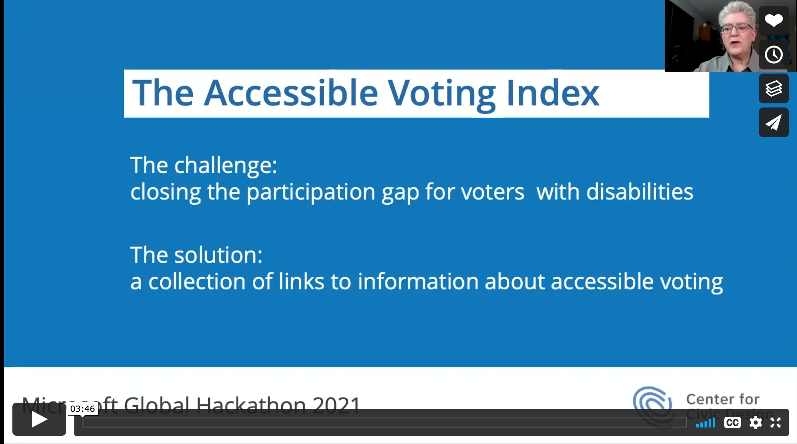

# Here's what you can do to help.

We’re collecting basic information for how to find information about accessible voting on a state election website. We’re focused on the official state websites in the United States because they should be a reliable and accessible source of information. The details you help us collect will be added to other data sources for policies and ways to vote, so we can create a resource that can help voters and be incorporated into other election information sites.

## Share your accessible voting stories</h2>
Do you have a story to tell? We want to hear it. We invite you to tell your own story about accessible voting. It can be from a recent election. Or it can be a chance to share your experience in this Hack as you tried to find information on a state website. We’ll use these stories to illustrate the importance of accessible voting and the ways elections can be full of barriers --- or delightful to use.

<a href="https://www.jotform.com/212715440153143" target="_blank"><b>Tell your story</b></a>

## Tell us your accessible voting information needs 
We want to make sure we are building a platform that makes sense! We want to know what information you find important when making your voting plan. What information is essential, what information needs to be easier to find, and what information you want about the accessible voting system in your state.

<a href="https://form.jotform.com/221078324908154" target="_blank"><b>Tell us your needs</b></a>
# Completed Tasks

## Collect basic website information
We built a picture of how easy it is for voters with disabilities to find and use information about accessible voting on the official election websites in 50 states and DC. Participents collected details about the information available on the state elections websites and did some quick checks of the accessibility of the information.

We've divided this into three separate activities,

* Basic accessibility review of the page for accessible voting.
* Findability review looking at the path to the information.
* Advanced accessibility review with a few more evals that needs some technical knowledge

[Go to the state elections website page to read more about this projec](https://civicdesign.github.io/Accessible-Voting-Index/state_resources/){: target="_blank"}

## Show us your design chops
Feeling creative? We’re gathering a lot of information and also need to make it delightful and intuitive to use. It needs to be accessible (of course), while making it easy to find and understand the accessible voting options in each state.

We looked for a design showcasing:
* A home page to show the scope of the information and start digging into the details by state
* A state page that is structured a easy to explore
* Ideas and inspirations for information visualizations
* A way to compare accessible voting in a 2 to 4 states
